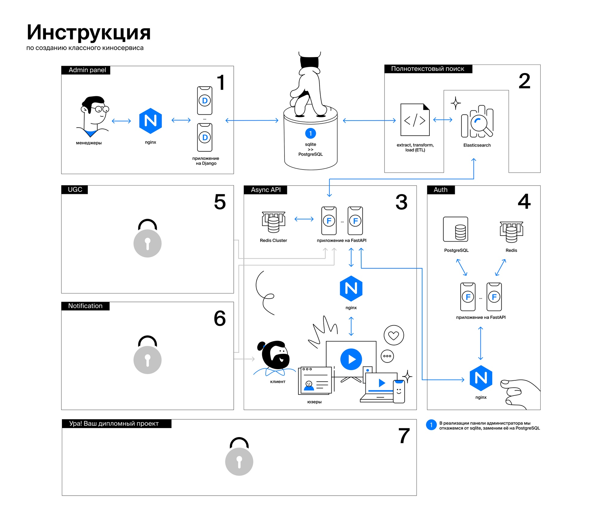
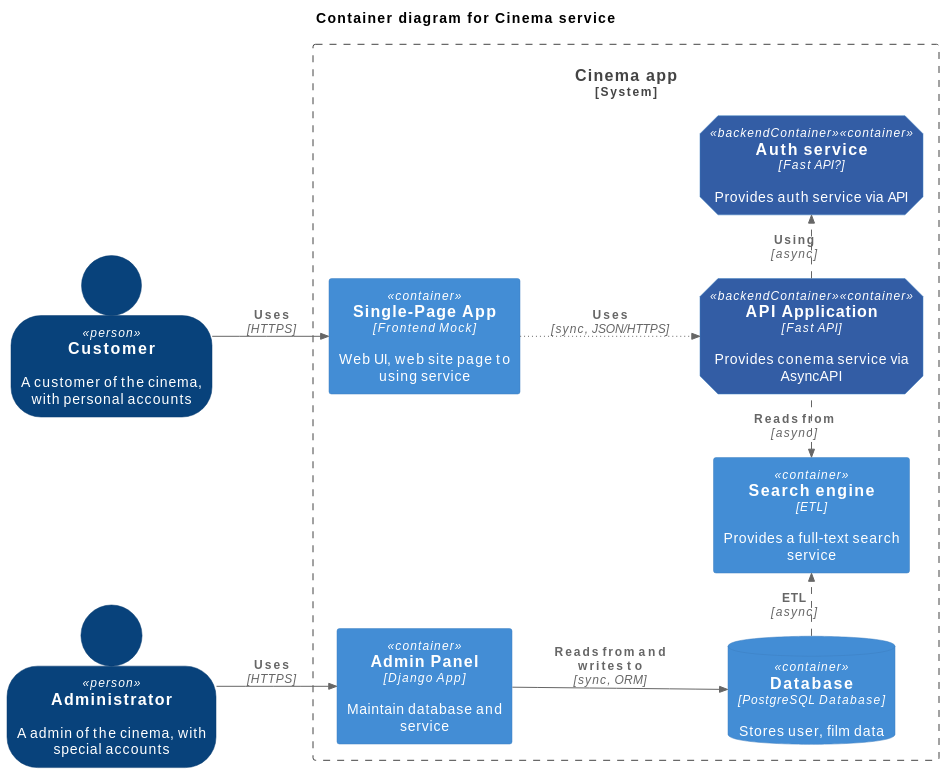

# Проект команды 2 "Онлайн кинотатр"

Общая структура проекта "Онлайн кинотеатр"

**Модульная схема:**



**Диаграма контейнеров приложения C2**




## [Auth service - Sprint 6](srs/auth.md)

## Запуск приложения

### Docker-compose

1. Выполнить команды:
```bash
make build && make up
```

### Локальный запуск

1. Активировать venv и создать .env по образцу
2. Установить зависимости

```bash
pip install --upgrade pip && pip install -r requirements.txt
```
3. Используйте docker-compose.yml 
Так же поднятие контейнеров с сервисами для локальной работы доступны через 

```bash
make dev-build && make dev-up
```
4. Переменные окружения в конфиге по умолчанию для локального запуска.

5. Запуск приложения

```bash
cd src && fastapi dev main.py
```

## Tests

### Локальный запуск

1. Выполнить команды:

```bash
cd tests/functional && make up-dev
```
2. Запустить командой:

```bash
pytest src
```

### Запуск в docker-compose

1. Выполнить команды:

```bash
cd tests/functional && make up
```


## Docs

Наш сервис поддерживает документацию OpenAPI Swagger по адресу:

http://127.0.0.1/api/openapi

## Состав команды

- TeamLead developer: [Maria Letunenko](https://github.com/mletunenko)
- Developer: [Artem Suhov](https://github.com/rock4ts)
- Developer: [Nikita Mikhaylov](https://github.com/Nikson276)

## Change log

- 2024-12-09: Создали базовую структуру проекта, документацию