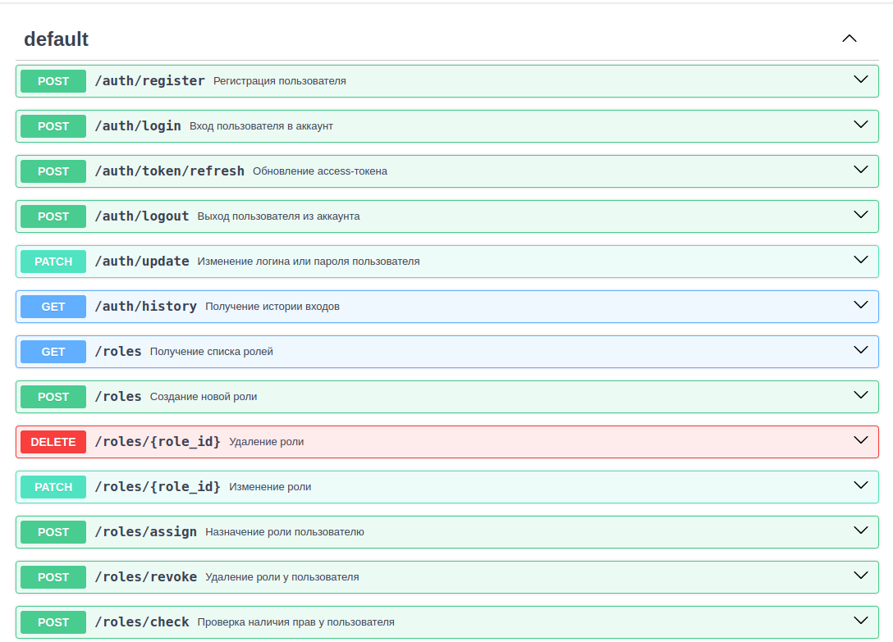
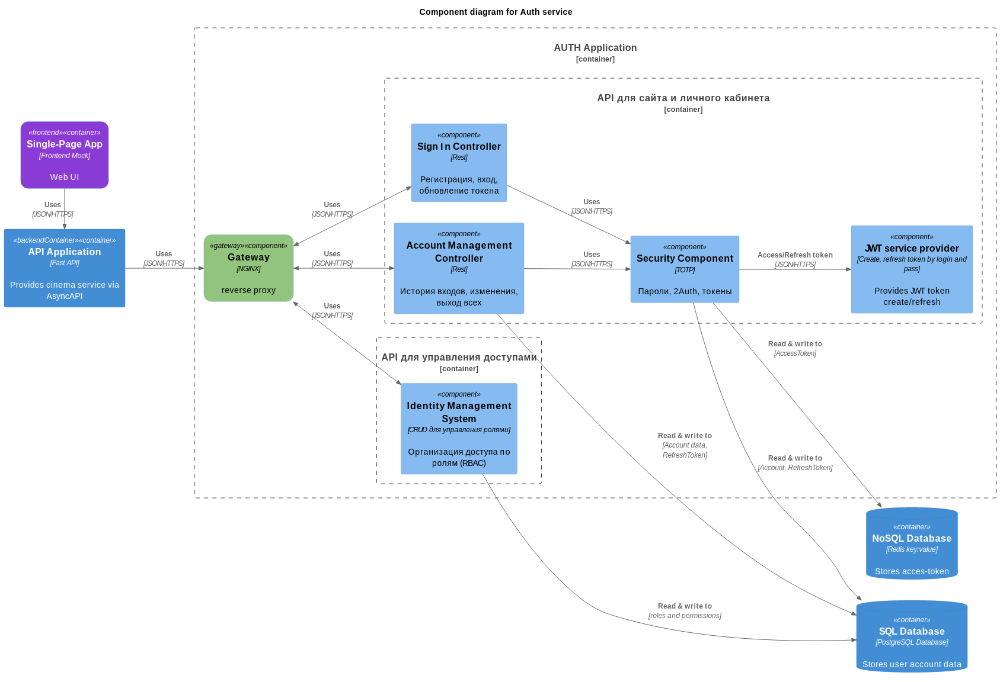

# Auth service

Проектная работа 6 спринта

https://github.com/mletunenko/Async_API_sprint_1_team

<!-- TODO Заменить ссылку на актуальный реп -->

## Бизнес-требования

### Критерии готовности

Анонимный пользователь может:

- Создать аккаунт, если выбранный email ещё не зарегистрирован в системе.
- Зарегистрироваться через социальную сеть.
- Войти в свой аккаунт по логину и паролю.
- Войти в свой аккаунт через социальную сеть с использованием OAuth 2.0.

Авторизированный пользователь может:

- Изменить свои личные данные — логин или пароль.
- Просмотреть историю входов в аккаунт.
- Посмотреть связанные аккаунты в социальных сетях.
- Открепить аккаунт социальной сети.

### Пользовательский интерфейс

- Регистрация аккаунта при помощи email и пароля:

- Изменение пароля:

- Личный кабинет:

## Функциональные требования

У вас должен получиться сервис авторизации с системой ролей, написанный на FastAPI.

[OpenAPI Swagger](https://editor-next.swagger.io/)

[Файл OpenAPI](openapi3_0.yaml)

### **Функциональные требования**

1. **Обработка исключительных ситуаций**
    
    - Сервис должен предусматривать обработку исключений для обеспечения отказоустойчивости.
    - При возникновении критической ошибки сервис должен автоматически перезапускаться.
2. **Аутентификация и авторизация**
    
    - Поддержка аутентификации пользователей.
    - Возможность сброса токенов пользователями.
    - Обеспечение авторизации для всех микросервисов системы на основе выданных токенов.
3. **Работа с токенами**
    
    - Генерация, валидация, обновление и ревокация access-токенов.
4. **Интеграция с другими сервисами**
    
    - Обеспечение взаимодействия с сервисами, связанными с выдачей контента, другими микросервисами и внешними клиентами.
5. **Работа с большими объёмами данных**
    
    - 500 000+ пользователей;
    - 500 000+ связанных аккаунтов;
    - 1 000 000+ записей о входах в аккаунт.

### **Нефункциональные требования**

1. **Отказоустойчивость**
    
    - При отказе сервиса авторизации другие сервисы сайта должны продолжать работу (где это применимо).
    - Архитектура должна предусматривать механизм быстрого восстановления после сбоев.
2. **Производительность**
    
    - Время ответа сервиса авторизации должно быть минимальным для обеспечения быстрого прохождения пользовательских запросов.
3. **Устойчивость к нагрузкам**
    
    - Сервис должен выдерживать значительную нагрузку, обусловленную большим количеством запросов от клиентов и других сервисов.
    - Поддержка горизонтального масштабирования с использованием оркестрации.
4. **Масштабируемость**
    
    - Возможность увеличения количества реплик сервиса авторизации для обработки повышенного количества запросов.
5. **Надёжность хранения данных**
    
    - Данные пользователей, связанные аккаунты и логи входов должны сохраняться без потерь и быть доступными в любое время.

### Обработка исключений

Обязательно продумайте и опишите обработку ошибок. 
Например:

- Как отреагирует ваш API, если обратиться к нему с истёкшим токеном?
- Будет ли отличаться ответ API, если передать ему токен с неверной подписью?
- А если имя пользователя уже занято?

Документация вашего API должна включать не только ответы сервера при успешном завершении запроса, но и понятное описание возможных ответов с ошибкой.

### Сценарии тестирования
pass

### API для сайта и личного кабинета

#### Sign In Controller
- регистрация пользователя;
- вход пользователя в аккаунт (обмен логина и пароля на пару токенов: JWT-access токен и refresh токен);
- обновление access-токена;
- выход пользователя из аккаунта;

#### Account Management Controller"
- получение пользователем своей истории входов в аккаунт;
- изменение логина или пароля (с отправкой email вы познакомитесь в следующих модулях, поэтому пока ваш сервис должен позволять изменять личные данные без дополнительных подтверждений);

### API для управления доступами

- CRUD для управления ролями:
    - создание роли,
    - удаление роли,
    - изменение роли,
    - просмотр всех ролей.
- назначить пользователю роль;
- отобрать у пользователя роль;
- метод для проверки наличия прав у пользователя.